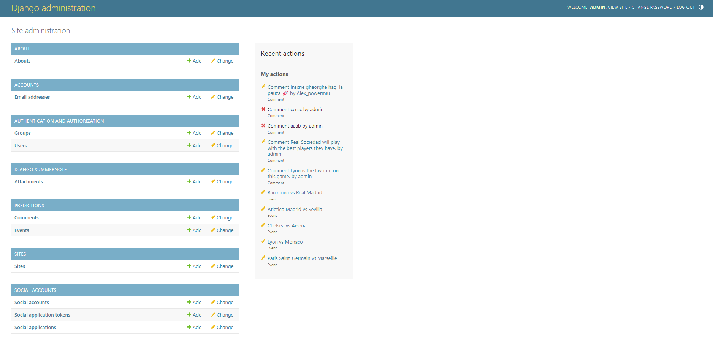
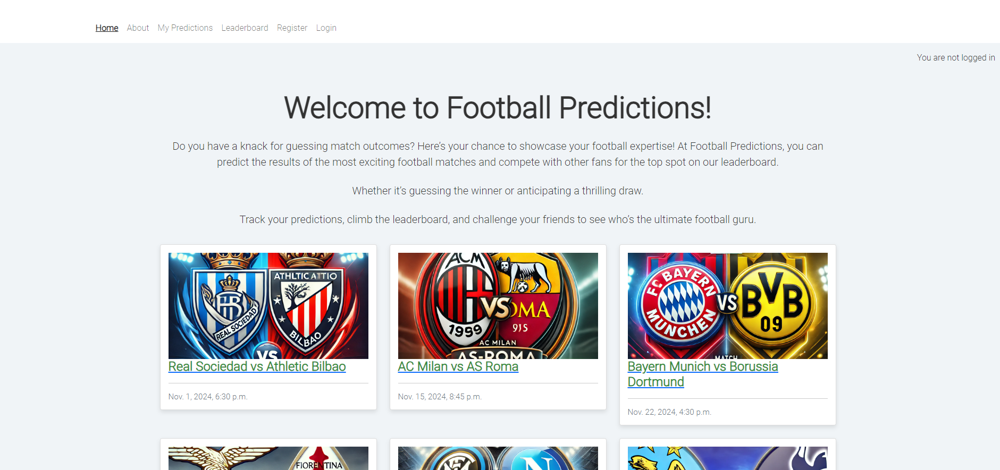
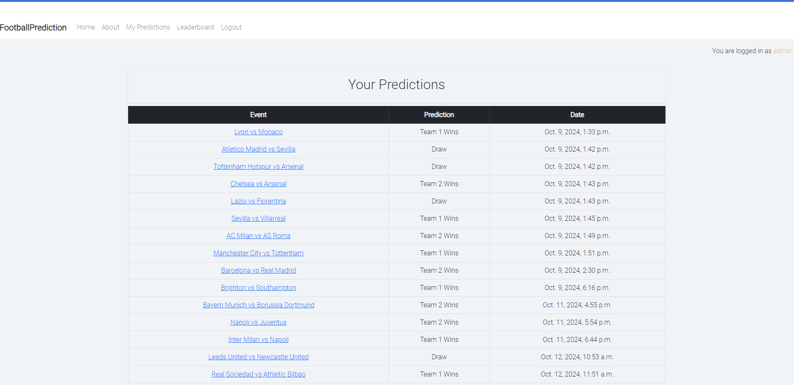
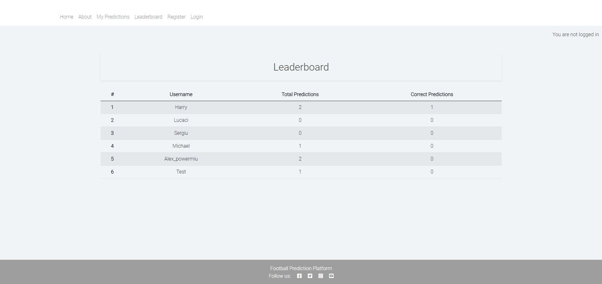
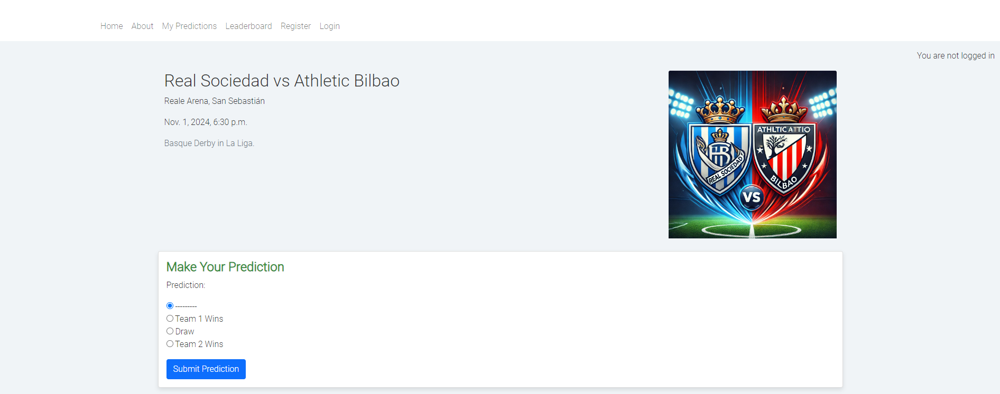
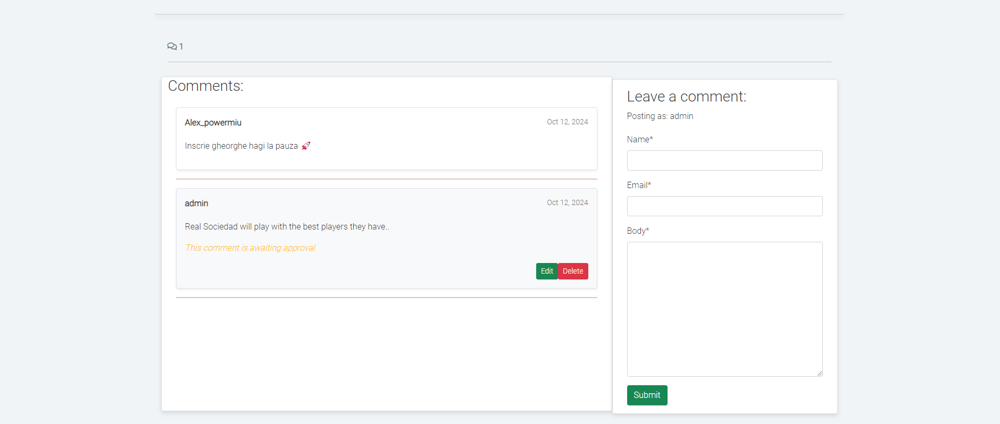

# Football Predictions

Visit the site deployed on Heroku: [Football Predictions](https://django-project-sergiu-cac25ce07138.herokuapp.com/)

Welcome to **Football Predictions**! Test your football knowledge by predicting match results, compete against other users, and track your prediction accuracy on the leaderboard. This platform is designed for football enthusiasts who enjoy predicting match outcomes and participating in friendly competitions.

## CONTENTS

- [User Experience](#user-experience-ux)
  - [User Stories](#user-stories)
- [Design](#design)
  - [Colour Scheme](#colour-scheme)
  - [Typography](#typography)
  - [Imagery](#imagery)
  - [Features](#features)
    - [The Admin Page](#the-admin-page)
    - [The Home Page](#the-home-page)
    - [The Past Predictions Page](#the-past-predictions-page)
    - [The Leaderboard Page](#the-leaderboard-page)
    - [The Match Detail Page](#the-match-detail-page)
    - [The Comments Feature](#the-comments-feature)
    - [Future Implementations](#future-implementations)
  - [Accessibility](#accessibility)
- [Technologies Used](#technologies-used)
  - [Languages Used](#languages-used)
  - [Frameworks, Libraries & Programs Used](#frameworks-libraries--programs-used)
- [Deployment & Local Development](#deployment--local-development)
  - [Deployment](#deployment)
  - [Local Development](#local-development)
    - [How to Fork](#how-to-fork)
    - [How to Clone](#how-to-clone)
- [Testing](#testing)
- [Credits](#credits)
  - [Code Used](#code-used)
  - [Content](#content)
  - [Acknowledgments](#acknowledgments)

## User Experience (UX)

### User Stories

#### First-time visitor

- As a first-time visitor, I want to easily sign up, log in, and start making football predictions right away.
- As a first-time visitor, I want to understand how the platform works and how my predictions are tracked and ranked.

#### Frequent visitor

- As a returning user, I want to see my past predictions and track my progress on the leaderboard.
- As a returning user, I want to participate in ongoing matches and predict their outcomes.

## Design

For this project, I have chosen a modern, sports-themed design with an intuitive interface, aimed at providing an engaging experience for football fans.

### Colour Scheme

I have used the following colors:

| Colour           | Hex                                                              |
| ---------------- | ---------------------------------------------------------------- |
| Primary Colour   |  #398e3d |
| Secondary Colour |  #0000FF |
| Accent Colour    |  #ffae00 |

### Typography

I used the **Roboto** font from Google Fonts for its clean and modern look, making the text easy to read.

### Imagery

The site features football-related imagery, including match visuals and team logos, to create a strong connection to the sport.

### Features

#### The Admin Page

The Admin page allows authorized administrators to manage the platform's content and user interactions efficiently. Admins can add, update, or delete football events, review and approve user comments. Events are automatically set to draft after their date has passed, ensuring that only upcoming or active events are visible to users.This page provides an intuitive interface to maintain the integrity of the platform, ensuring that only valid events and predictions are displayed. Additionally, admins can monitor user activity, making it easier to oversee and moderate content on the platform.

#### The Home Page

The home page provides a clear call-to-action for users to sign up or log in, with an overview of upcoming matches and recent results. It serves as the central hub for accessing all features.

#### The Past Predictions Page

The Past Predictions page allows users to view all their previous match predictions in one place.

#### The Leaderboard Page

The leaderboard displays users ranked by their prediction accuracy, fostering a competitive atmosphere. Users can compare their performance with others.

#### The Match Detail Page

Each match has its own detail page where users can view additional information, make predictions, and see other users' comments.

#### The Comments Feature

Users can leave comments on match pages to discuss the match or their predictions with other users. This adds a social element to the platform.

#### Future Implementations

**Real-Time Match Updates**:

- Integrate a live score API to provide real-time updates on ongoing matches. This would enhance user engagement by allowing users to follow the matches they’ve predicted.

**Match/Event Notifications**:

- Implement a notification system to alert users about upcoming matches, when new events are available for prediction, or when the match results are in.

### Accessibility

1. **Alt Text for Images**: All images on the website include descriptive alt text for users with screen readers.
2. **Semantic HTML**: Proper use of HTML5 semantic elements ensures that the site is accessible to users with assistive technologies.
3. **Keyboard Navigation**: All interactive elements, including forms and buttons, are accessible via keyboard navigation.

## Technologies Used

#### Languages Used

- HTML
- CSS
- JavaScript
- Python (Django framework)

#### Frameworks, Libraries & Programs Used

- **Django**: Backend framework to manage the server and handle user requests.
- **Bootstrap**: For responsive and mobile-first web design.
- **Google Fonts**: To import the Roboto font.
- **Cloudinary**: For hosting images used on the site.
- **GitHub**: For version control and deployment.
- **Font Awesome**: For icons used throughout the site.

## Deployment & Local Development

### Deployment

The site is deployed using Heroku on - [Football Predictions](https://your-heroku-app-url)

Steps to deploy on Heroku:

1. Create a new app on Heroku.
2. Connect the Heroku app to your GitHub repository.
3. Set up the necessary environment variables and buildpacks.
4. Deploy the app from the Heroku dashboard.

### Local Development

#### How to Fork

To fork the repository:

1. Login to your GitHub Account.
2. Go to: [Football-prediction](https://github.com/slucaci/Football-prediction-project4)
3. Click the Fork button in the top right corner.

#### How to Clone

To clone the repository:

1. Login to your GitHub Account.
2. Go to: [Football-prediction](https://github.com/slucaci/Football-prediction-project4)
3. On the repository's main page, find the green "Code" button located towards the right side of the page.
4. Copy the URL provided in the textbox.
5. Type 'git clone' into your terminal and paste the link. Press enter.

## Testing

Check the [TESTING.md](TESTING.md) file for a detailed summary of all testing procedures conducted.

## Credits

### Code used

- Various tutorials from YouTube channels like [Bro Code](https://www.youtube.com/@BroCodez).
- Code Institute’s learning material for understanding Django and implementing user authentication.
- [Stack Overflow](https://stackoverflow.com/) was frequently used to troubleshoot issues and find solutions to common coding problems throughout the project.

### Content

- All match data is sourced from public football databases.
- All images used on the site are hosted on Cloudinary.

### Acknowledgments

- Code Institute for providing the project framework.
- Friends for testing and providing feedback during the development process.
