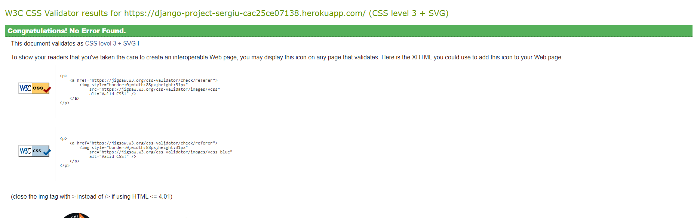
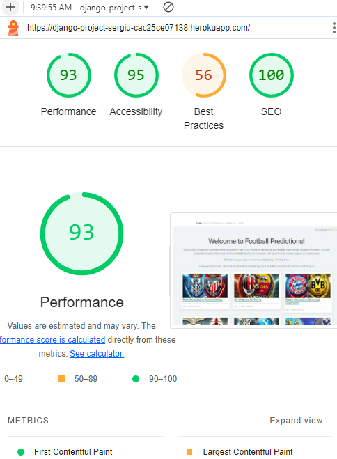
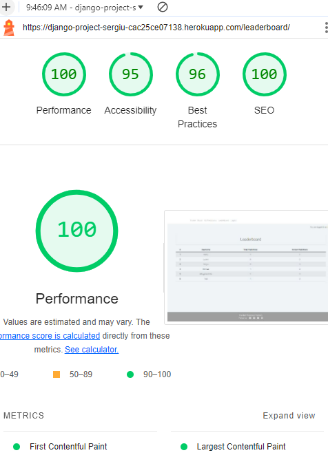
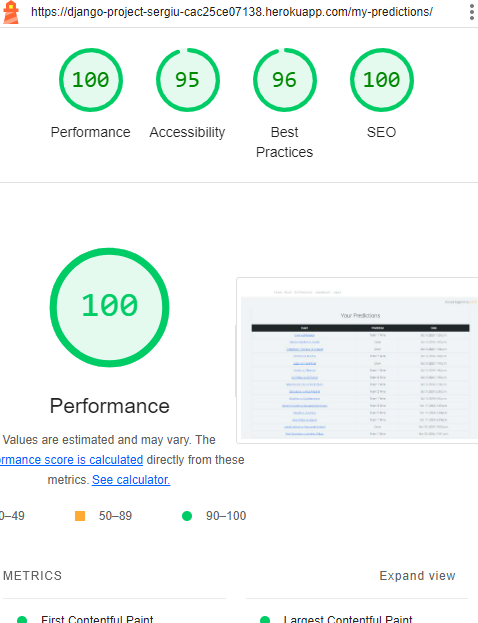
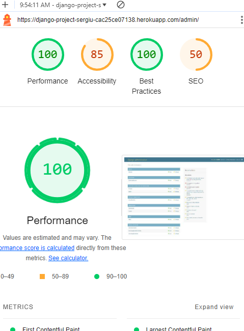
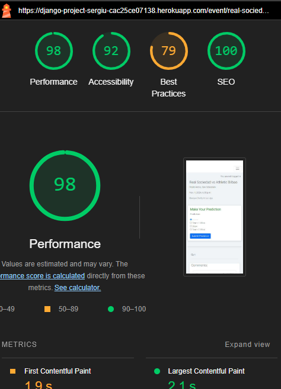
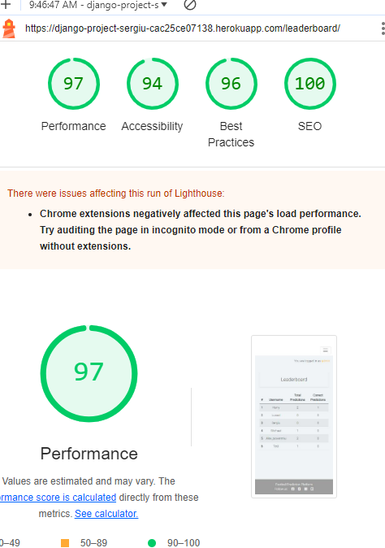
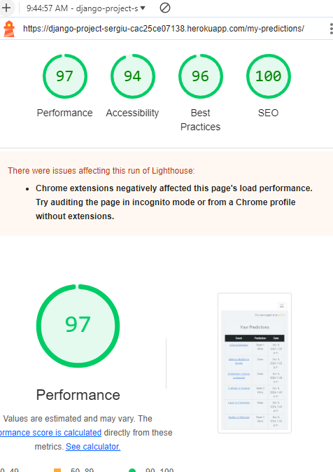
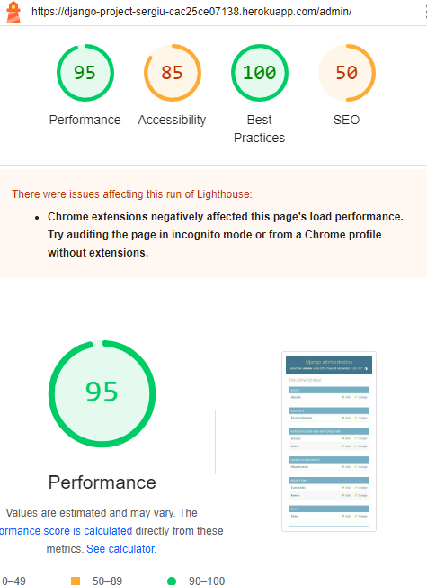

# Football Predictions

Visit the site deployed on Heroku: [Football Predictions](https://django-project-sergiu-cac25ce07138.herokuapp.com/)

## CONTENTS

- [AUTOMATED TESTING](#AUTOMATED-TESTING)

  - [W3C Validator](#W3C-Validator)

  - [Form Tests](#form-tests)

  - [Lighthouse](#Lighthouse)

- [MANUAL TESTING](#MANUAL-TESTING)

  - [Testing User Stories](#Testing-User-Stories)

## AUTOMATED TESTING

### W3C Validator

[HTML W3C](https://validator.w3.org/) was used to validate the HTML code.

- [Home Page](https://django-project-sergiu-cac25ce07138.herokuapp.com/) - 0 errors
- [Leaderboard Page](https://django-project-sergiu-cac25ce07138.herokuapp.com/leaderboard/) - 0 errors
- [Predictions Page](https://django-project-sergiu-cac25ce07138.herokuapp.com/my-predictions/) - 0 errors
- [Match Detail Page](https://django-project-sergiu-cac25ce07138.herokuapp.com/event/real-sociedad-vs-athletic-bilbao/) - 0 errors

[CSS W3C](https://jigsaw.w3.org/css-validator/) was used to validate the CSS code.

- style.css file - 0 errors
  

### Form Tests

#### 1. **CommentForm Tests**

The `CommentForm` tests ensure that the form is validated correctly, both with valid and invalid data.

##### Test Cases

- **`test_comment_form_valid`**:

  - **Objective**: To verify that the `CommentForm` is valid when provided with all the required fields (`name`, `email`, `body`).
  - **Result**: The form is valid with proper data.

- **`test_comment_form_invalid`**:

  - **Objective**: To verify that the `CommentForm` is invalid when the `name` field is left empty.
  - **Result**: The form is invalid when a required field is missing.

#### 2. **PredictionForm Tests**

The `PredictionForm` tests ensure that the form validates the prediction correctly, based on the user's input.

##### Test Cases

- **`test_prediction_form_valid`**:

  - **Objective**: To verify that the `PredictionForm` is valid when a valid prediction (`'X1'`) is provided.
  - **Result**: The form is valid when proper data is submitted.

- **`test_prediction_form_invalid`**:

  - **Objective**: To verify that the `PredictionForm` is invalid when no prediction is made.
  - **Result**: The form is invalid when no data is provided.

### LightHouse

I have used developer tools Lighthouse to test my website on mobile and desktop versions.

#### Desktop Version

#### Mobile Version

## MANUAL TESTING

### Navigation Test:

1. Click on each navigation link (Home, Leaderboard, Predictions, Match Detail) in the header navigation bar.
2. Verify that each link redirects to the corresponding page without any errors.
3. Ensure that the active link is visually distinguished from the other links.

### Prediction Submission Test:

1. Go to the Predictions page.
2. Select a prediction (Team 1 Wins, Draw, or Team 2 Wins) for an upcoming match.
3. Submit the prediction and verify that it saves correctly.
4. Check that the prediction appears under your profile's past predictions section.

### Leaderboard Functionality Test:

1. Navigate to the Leaderboard page.
2. Verify that users are ranked according to their prediction accuracy.
3. Ensure that the leaderboard updates correctly after new predictions are submitted.

### Comment Submission Test:

1. Go to the Match Detail page for any match.
2. Leave a comment and verify that it appears under the match.
3. Test submitting comments with valid and invalid inputs to check validation.

### Links Test:

1. Check if all links open in a new tab/window.
2. Ensure all links function correctly on various devices and screen sizes.
